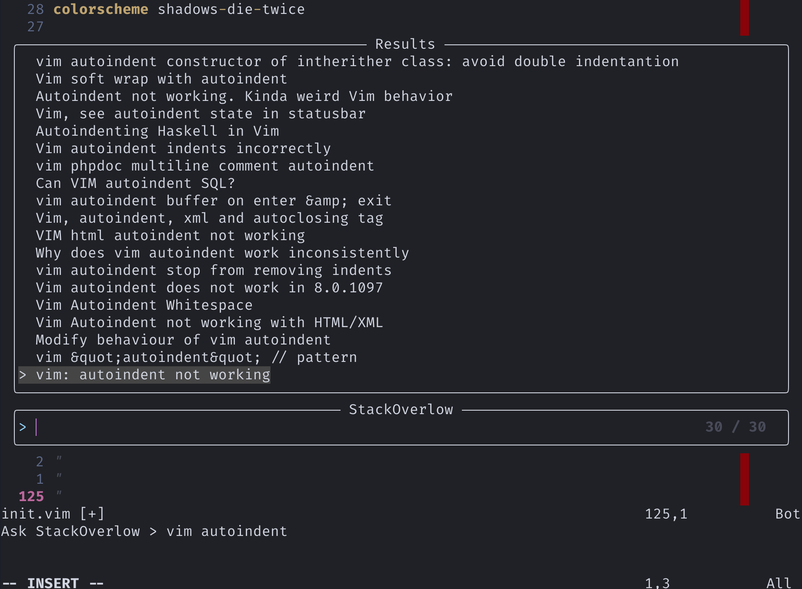

# Rubberduck

*Early alpha, pure experimental, do not use ot it will break everything*

Struggling with code? Rubberduck is here to help you figure out what's wrong!

### Features

 - Search stackoverflow with telescope. Use with:
 ```vim
 :Telescope rubberduck stackoverflow
 ```

### Installation

Use your favorite plugin manager! We need some dependencies tho

```vim
" init.vim
Plug "nvim-lua/popup.nvim"
Plug "nvim-lua/plenary.nvim"
Plug "nvim-telescope/telescope.nvim"
Plug "eruizc-dev/rubberduck.nvim"
```

Attach extension to telescope

```lua
-- init.lua
require("telescope").load_extension("rubberduck")
```

```vim
" init.vim
lua require("telescope").load_extension("rubberduck")
```
#### How does it look?
[](resources:/look.png "LookAndFeel")

